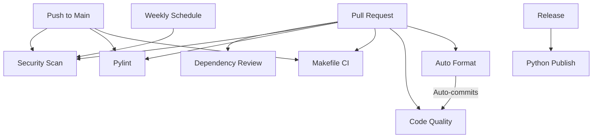

# GitHub Actions Workflows

This directory contains automated CI/CD workflows for the account-scanner project.

## Workflows Overview

### 🔧 Auto Format Code (`auto-format.yml`)
**Triggers:** Pull requests modifying Python files

Automatically formats code using Ruff when PRs are opened or updated.

**Features:**
- Auto-formats code and commits changes for internal PRs
- Runs format checks only for external contributor PRs
- Posts helpful comments on PRs
- Skips subsequent CI runs with `[skip ci]`

**Concurrency:** Cancels previous runs for the same PR

---

### ✨ Code Quality (`code-quality.yml`)
**Triggers:** Pull requests modifying Python files

Comprehensive code quality analysis and metrics reporting.

**Checks:**
- Ruff linting with detailed statistics
- Ruff format verification
- MyPy type checking
- Code metrics and line counts

**Features:**
- Generates detailed summary in PR
- Provides actionable feedback
- Non-blocking checks for early feedback

**Concurrency:** Cancels previous runs for the same PR

---

### 🔨 Makefile CI (`makefile.yml`)
**Triggers:** Push to main, pull requests modifying Python/config files

Runs all Makefile targets across multiple Python versions.

**Test Matrix:**
- Python 3.11, 3.12, 3.13
- Full test suite on each version

**Checks:**
- Code formatting (enforced)
- Linting
- Type checking
- Test suite

**Optimizations:**
- Pip dependency caching
- Tool cache (Ruff, MyPy, pytest)
- Path-based triggers
- Parallel matrix execution

**Concurrency:** Cancels previous runs for the same ref

---

### 🔍 Pylint (`pylint.yml`)
**Triggers:** Push to main, pull requests modifying Python files

Static code analysis using Pylint across multiple Python versions.

**Test Matrix:**
- Python 3.11, 3.12, 3.13
- Generates JSON reports for each version

**Features:**
- Colorized output
- Score reporting
- Artifact upload for analysis
- Pylint cache optimization

**Optimizations:**
- Pip caching
- Pylint result caching
- Path-based triggers

**Concurrency:** Cancels previous runs for the same ref

---

### 🛡️ Security Scan (`security-scan.yml`)
**Triggers:**
- Push to main
- Pull requests
- Weekly schedule (Sundays at midnight UTC)
- Manual dispatch

Comprehensive security scanning suite.

**Scans:**
1. **pip-audit** - Dependency vulnerability scanning
2. **Bandit** - Python code security analysis
3. **Safety** - Dependency safety database checks
4. **CodeQL** - Advanced semantic code analysis
5. **TruffleHog** - Secret scanning in git history

**Features:**
- Multiple security perspectives
- SARIF report upload
- Artifact storage (30 days)
- Summary generation
- Non-failing safety checks

**Optimizations:**
- Path-based triggers for push/PR
- Pip caching
- Parallel job execution
- Concurrency control (doesn't cancel security scans)

---

### 📦 Python Publish (`python-publish.yml`)
**Triggers:** GitHub releases

Builds and publishes the package to PyPI.

**Process:**
1. Build release distributions
2. Upload artifacts
3. Publish to PyPI using trusted publishing

**Features:**
- Trusted publishing (no API tokens needed)
- Separate build and publish jobs
- Protected PyPI environment

---

### 🔐 Dependency Review (`dependency-review.yml`)
**Triggers:** Pull requests to main

Reviews dependency changes in pull requests.

**Features:**
- Identifies vulnerable dependencies
- Comments summary in PR
- Blocks PRs with known vulnerabilities (if configured)
- License compliance checks (optional)

---

## Optimization Features

All workflows implement modern GitHub Actions best practices:

### 🚀 Performance Optimizations
- **Concurrency Groups:** Prevents redundant workflow runs
- **Path Filters:** Only triggers when relevant files change
- **Caching Strategies:**
  - Pip dependencies
  - Tool-specific caches (Ruff, MyPy, Pylint)
  - Test results
- **Parallel Execution:** Matrix builds and independent jobs run concurrently

### 📊 Enhanced Reporting
- Workflow summaries with markdown formatting
- Artifact uploads for detailed analysis
- PR comments with actionable feedback
- Colorized and formatted output

### 🔄 Smart Triggers
- Path-based filtering reduces unnecessary runs
- Concurrency cancellation saves compute time
- Scheduled security scans for continuous monitoring

## Local Development

Run the same checks locally using the Makefile:

```bash
# Run all CI checks
make ci

# Individual checks
make format-check  # Check formatting
make lint          # Run linting
make type          # Type checking
make test          # Run tests

# Auto-fix issues
make format        # Auto-format code
make lint-fix      # Fix linting issues

# Additional checks
make security      # Security analysis
make audit         # Dependency audit
make test-cov      # Tests with coverage
```

## Workflow Dependencies



## Configuration Files

- `pyproject.toml` - Ruff, MyPy, pytest configuration
- `Makefile` - Local development commands
- `PKGBUILD` - Arch Linux package build

## Maintenance

- Review workflow runs regularly
- Update action versions when security advisories are published
- Adjust caching strategies if disk usage is high
- Monitor artifact storage usage

## Contributing

When modifying workflows:
1. Test changes in a fork first
2. Use path filters to prevent unnecessary runs
3. Add concurrency groups for cancellation
4. Include caching for frequently downloaded dependencies
5. Generate helpful summaries and reports
6. Document new workflows in this README
